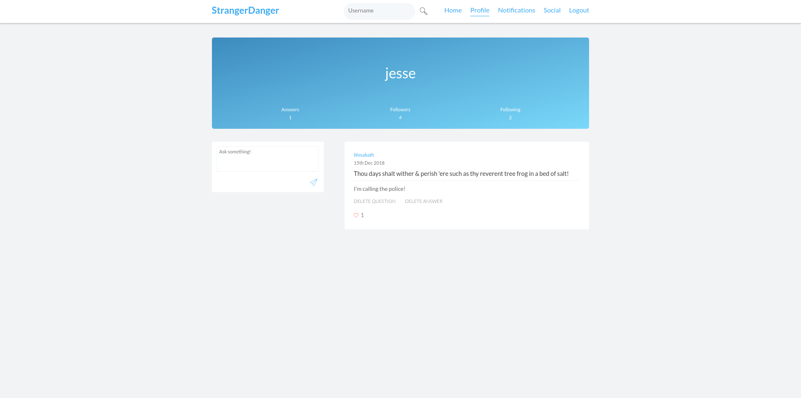

# StrangerDanger - A Social Media Travesty 
StrangerDanger is the very first Full-Stack application I've built. It's a clone of CuriousCat (euphemism for "shameless rip off") and served as a learning exercise to understand the MERN stack. 



# Main Features 

- **Profile Creation**
- **User Authentication**
- **Submit Questions to Users (Including Anonymously)**
- **Answer Questions Via User Dashboard** 
- **Profile Search**
- **Password Retrival** 
- **Follow/Unfollow Users**
- **Notifications For Received Replies**
- **View New Posts From Currently Following Users (Feed)**
- **Like Posts**
- **Infinite Scrolling**

# Getting Started (Locally) 

```Note: Node v9.2.1 is recommended.``` 

1. Run ```npm install``` in both ```SD_Server``` and ```SD_Client``` 
1. Fire up Mongodb with the usual ```sudo mongod``` command 
1. cd into SD_Server and run ```node app.js```
1. cd into SD_Client and run ```npm start```

